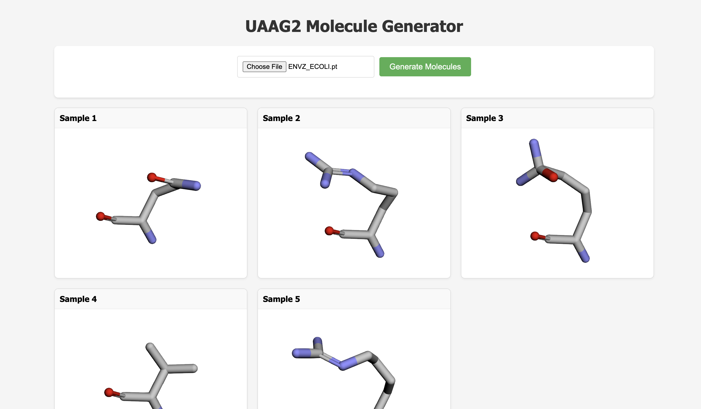

# UAAG2: Uncanonical Amino Acid Generative Model v2

### Overall goal of the project
The project implements an **MLOps pipeline** for **UAAG2** (Uncanonical Amino Acid Generative Model v2), a diffusion-based generative model for protein engineering. While standard models are restricted to 20 natural amino acids, UAAG2 models side chains in full atomic detail as graphs. Our goal is to transition this $E(3)$-equivariant framework into a production system capable of predicting variant effects for non-canonical amino acids (NCAAs).

### Data
* **Protein Data Bank (PDB)**: 1,000 structures are used to extract residues and local environments within a 10 Å radius.
* **NCAA Datasets**: Data from SwissSidechain and Ilardo et al. (2019) provide novel chemical environments.
* **PDBBind**: Protein-ligand complexes are integrated to capture diverse non-covalent interactions.
* **DMS Benchmarks**: Performance is validated against experimental Deep Mutational Scanning data, specifically PUMA and CP2 benchmarks.

### Hugging Face data checks
We mirror the primary dataset in the public Hugging Face repository `yhsure/uaag2-data`. To refresh local data and
generate a basic markdown report, run:

```bash
$ uv run invoke fetch-data
$ uv run python src/uaag2/hf_data_report.py
```

### Model
The architecture is an **$E(3)$-equivariant Graph Neural Network** based on the EQGAT-diff framework, utilizing 7 message-passing layers and 3.6M parameters. It employs a multi-modal diffusion process that perturbs continuous atomic coordinates and discrete categorical features like atom types and formal charges. To accommodate variable atom counts, the model implements a **virtual node strategy**, allowing it to sample side chains of varying sizes within a unified generative paradigm. Denoising ensures Euclidean symmetry, and mutational effects are calculated by comparing sampled likelihoods of mutant versus wild-type residues.

### Ops architecture

```
                                      +----------------------------------------------+
                                      |              GOOGLE CLOUD PLATFORM           |
                                      |                                              |
 +-----------------+                  |  +-------------+       +------------------+  |
 | git commit      |                  |  | Cloud Build +------>+ Artifact Registry|  |
 | w/ linting hook |                  |  | (Build Img) | push  | (Docker Images)  |  |
 +-----+-----------+                  |  +-------------+       +--------+---------+  |
       |                              |    ^                            |            |
       |                              |    |                            | pull       |
       v                              |    |                    +-------v-------+    |
 +-------------+   +--------------+   |    |      stream data   | Vertex AI     |    |
 | git push    +-->+ GitHub       |---------    +-------------->| (Training)    |    |
 | (Trigger)   |   | Actions (CI) |   |         |               +-------+-------+    |
 +-------------+   +--------------+   |         |                       |            |
                                      |         |                       | logs       |
 +-------------+                      |         |                       v            |
 | HuggingFace +--------------------------------+                       |            |
 | (Datasets)  |                      |                                 |            |
 +-------------+                      |                                 |            |
                                      |                                 |            |
 +-------------+                      |                                 |            |
 |    WandB    |<-------------------------------------------------------+            |
 |(Experiments)|                      |                                              |
 +-----+-------+                      |                                              |
       |                              |                                              |
       | register                     |                                              |
       v                              |                                              |
 +-----+-------+                      |  +-----------------+     +--------------+    |
 | Model Reg   |    dev trigger       |  |  API Deploy WF  +---->+  Cloud Run   |    |
 |(Versioning) +------------------------>|                 |     | (Serverless) |    |
 +-------------+   (Tag: staging)     |  +-----------------+     +------+-------+    |
                                      |                                 ^            |
                                      +---------------------------------|------------+
                                                                        |
                                                                 +------+-------+
                                                                 |   End User   |
                                                                 |  (Frontend)  |
                                                                 +--------------+
```

### Nix Development Environment
A `flake.nix` file is provided to manage system-level dependencies (such as Docker, Colima, and the Google Cloud SDK) that are not managed by `uv`. Run `nix develop` to enter a shell with these tools pre-installed.

## Invoke Tasks

The project uses `invoke` to manage common tasks with default arguments. You can run them using `uv run invoke <task_name>`.

*   `fetch-data`: Fetch protein data from Hugging Face Hub.
*   `fetch-model`: Fetch model artifact from Weights & Biases.
*   `train`: Train the model. Supports various flags for hyperparameters (e.g., `--num-epochs`, `--batch-size`).
*   `evaluate`: Evaluate the model on benchmark data.
*   `test`: Run tests and calculate coverage.
*   `docker-build`: Build docker images.

## Using the API

The UAAG2 API is deployed and running on Google Cloud Run on the **URL** [https://uaag2-api-233301800073.europe-west1.run.app/](https://uaag2-api-233301800073.europe-west1.run.app/)

The API can alternatively be run locally using `uv run python src/uaag2/api.py`. In this case, it is available at `http://localhost:8000`.



### Programmatic Access

#### Using Curl
You can generate molecules by sending a POST request to the `/generate` endpoint with a `.pt` file.

```bash
curl -X POST -F "file=@data/benchmarks/ENVZ_ECOLI.pt" https://uaag2-api-233301800073.europe-west1.run.app/generate
```

#### Using Python
```python
import requests

url = "https://uaag2-api-233301800073.europe-west1.run.app/generate"
files = {'file': open('data/benchmarks/ENVZ_ECOLI.pt', 'rb')}

response = requests.post(url, files=files)
print(response.json())
```

## Project Architecture

```
                                      +--------------------------------------------------+
                                      |              GOOGLE CLOUD PLATFORM               |
                                      |                                                  |
 +-------------+   git push           |  +-------------+       +------------------+      |
 |  Developer  +------------------------>| Cloud Build +------>+ Artifact Registry|      |
 | (Local/uv)  |   (Trigger)          |  | (Build Img) | push  | (Docker Images)  |      |
 +-----+-------+                      |  +-------------+       +--------+---------+      |
       |                              |                                 |                |
       | pre-commit                   |                                 | pull           |
       v                              |                         +-------v-------+        |
 +-------------+   +--------------+   |           stream data   | Compute Engine|        |
 | git commit  +-->+ GitHub       |   |         +-------------->| (Training VM) |        |
 | (Quality)   |   | Actions (CI) |   |         |               +-------+-------+        |
 +-------------+   +--------------+   |         |                       |                |
                                      |         |                       | logs           |
 +-------------+                      |         |                       v                |
 | HuggingFace +--------------------------------+                       |                |
 | (Datasets)  |                      |                                 |                |
 +-------------+                      |                                 |                |
                                      |                                 |                |
 +-------------+                      |                                 |                |
 |    WandB    |<-------------------------------------------------------+                |
 |(Experiments)|                      |                                                  |
 +-----+-------+                      |                                                  |
       |                              |                                                  |
       | register                     |                                                  |
       v                              |                                                  |
 +-----+-------+                      |  +-----------------+     +--------------+        |
 | Model Reg   |    dev trigger       |  |  API Deploy WF  +---->+  Cloud Run   |        |
 |(Versioning) +------------------------>|  (Retag/Push)   |     | (Serverless) |        |
 +-------------+   (Tag: staging)     |  +-----------------+     +------+-------+        |
                                      |                                 ^                |
                                      +---------------------------------|----------------+
                                                                        |
                                                                 +------+-------+
                                                                 |   End User   |
                                                                 |  (Frontend)  |
                                                                 +--------------+
```


*Project template created using [mlops_template](https://github.com/SkafteNicki/mlops_template), a [cookiecutter template](https://github.com/cookiecutter/cookiecutter) for getting started with Machine Learning Operations (MLOps).*
