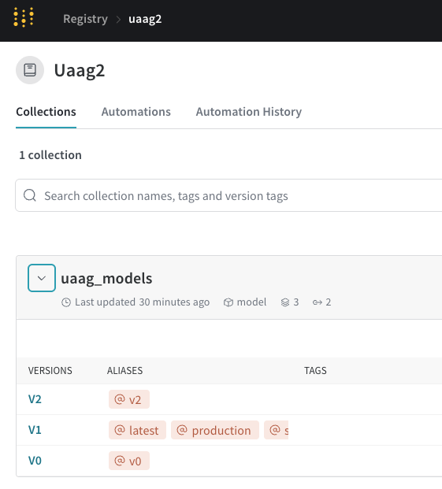
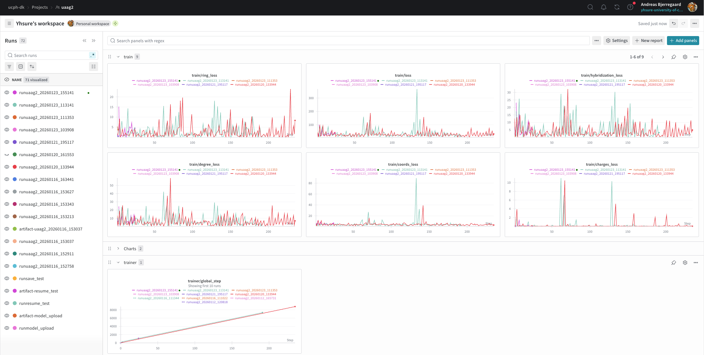
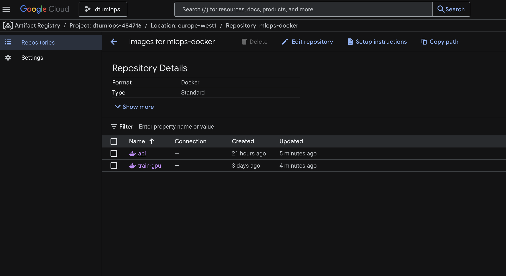
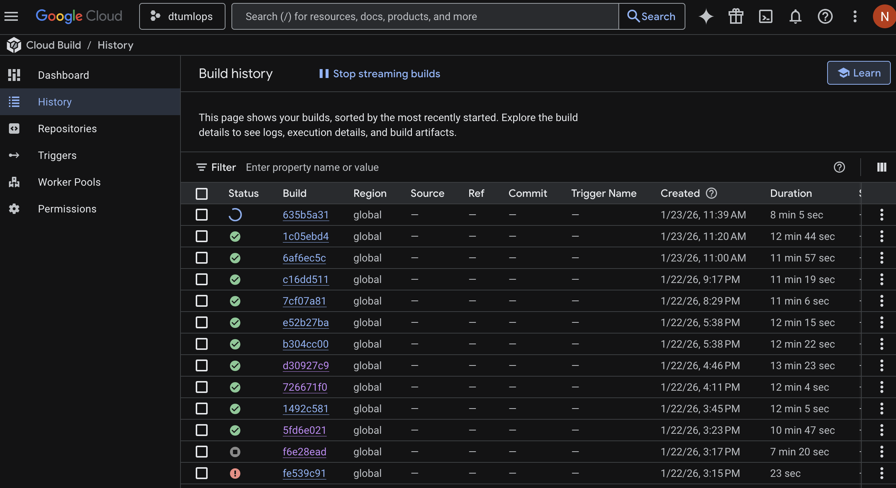
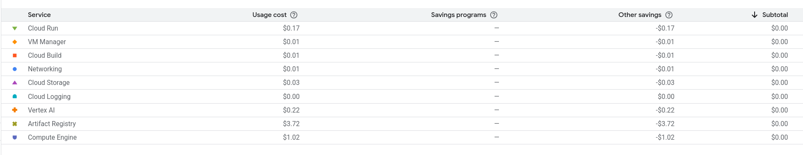

# Exam template for 02476 Machine Learning Operations

This is the report template for the exam. Please only remove the text formatted as with three dashes in front and behind
like:

```--- question 1 fill here ---```

Where you instead should add your answers. Any other changes may have unwanted consequences when your report is
auto-generated at the end of the course. For questions where you are asked to include images, start by adding the image
to the `figures` subfolder (please only use `.png`, `.jpg` or `.jpeg`) and then add the following code in your answer:

``

In addition to this markdown file, we also provide the `report.py` script that provides two utility functions:

Running:

```bash
python report.py html
```

Will generate a `.html` page of your report. After the deadline for answering this template, we will auto-scrape
everything in this `reports` folder and then use this utility to generate a `.html` page that will be your serve
as your final hand-in.

Running

```bash
python report.py check
```

Will check your answers in this template against the constraints listed for each question e.g. is your answer too
short, too long, or have you included an image when asked. For both functions to work you mustn't rename anything.
The script has two dependencies that can be installed with

```bash
pip install typer markdown
```

or

```bash
uv add typer markdown
```

## Overall project checklist

The checklist is *exhaustive* which means that it includes everything that you could do on the project included in the
curriculum in this course. Therefore, we do not expect at all that you have checked all boxes at the end of the project.
The parenthesis at the end indicates what module the bullet point is related to. Please be honest in your answers, we
will check the repositories and the code to verify your answers.

### Week 1

* [x] Create a git repository (M5)
* [x] Make sure that all team members have write access to the GitHub repository (M5)
* [x] Create a dedicated environment for you project to keep track of your packages (M2)
* [x] Create the initial file structure using cookiecutter with an appropriate template (M6)
* [x] Fill out the `data.py` file such that it downloads whatever data you need and preprocesses it (if necessary) (M6)
* [x] Add a model to `model.py` and a training procedure to `train.py` and get that running (M6)
* [x] Remember to either fill out the `requirements.txt`/`requirements_dev.txt` files or keeping your
    `pyproject.toml`/`uv.lock` up-to-date with whatever dependencies that you are using (M2+M6)
* [x] Remember to comply with good coding practices (`pep8`) while doing the project (M7)
* [x] Do a bit of code typing and remember to document essential parts of your code (M7)
* [x] Setup version control for your data or part of your data (M8)
* [x] Add command line interfaces and project commands to your code where it makes sense (M9)
* [x] Construct one or multiple docker files for your code (M10)
* [x] Build the docker files locally and make sure they work as intended (M10)
* [x] Write one or multiple configurations files for your experiments (M11)
* [x] Used Hydra to load the configurations and manage your hyperparameters (M11)
* [x] Use profiling to optimize your code (M12)
* [x] Use logging to log important events in your code (M14)
* [x] Use Weights & Biases to log training progress and other important metrics/artifacts in your code (M14)
* [ ] Consider running a hyperparameter optimization sweep (M14)
* [x] Use PyTorch-lightning (if applicable) to reduce the amount of boilerplate in your code (M15)

### Week 2

* [x] Write unit tests related to the data part of your code (M16)
* [x] Write unit tests related to model construction and or model training (M16)
* [x] Calculate the code coverage (M16)
* [x] Get some continuous integration running on the GitHub repository (M17)
* [x] Add caching and multi-os/python/pytorch testing to your continuous integration (M17)
* [x] Add a linting step to your continuous integration (M17)
* [x] Add pre-commit hooks to your version control setup (M18)
* [x] Add a continues workflow that triggers when data changes (M19)
* [x] Add a continues workflow that triggers when changes to the model registry is made (M19)
* [x] Create a data storage in GCP Bucket for your data and link this with your data version control setup (M21)
* [x] Create a trigger workflow for automatically building your docker images (M21)
* [x] Get your model training in GCP using either the Engine or Vertex AI (M21)
* [x] Create a FastAPI application that can do inference using your model (M22)
* [x] Deploy your model in GCP using either Functions or Run as the backend (M23)
* [x] Write API tests for your application and setup continues integration for these (M24)
* [x] Load test your application (M24)
* [ ] Create a more specialized ML-deployment API using either ONNX or BentoML, or both (M25)
* [x] Create a frontend for your API (M26)

### Week 3

* [ ] Check how robust your model is towards data drifting (M27)
* [ ] Setup collection of input-output data from your deployed application (M27)
* [ ] Deploy to the cloud a drift detection API (M27)
* [x] Instrument your API with a couple of system metrics (M28)
* [x] Setup cloud monitoring of your instrumented application (M28)
* [ ] Create one or more alert systems in GCP to alert you if your app is not behaving correctly (M28)
* [ ] If applicable, optimize the performance of your data loading using distributed data loading (M29)
* [ ] If applicable, optimize the performance of your training pipeline by using distributed training (M30)
* [x] Play around with quantization, compilation and pruning for you trained models to increase inference speed (M31)

### Extra

* [x] Write some documentation for your application (M32)
* [ ] Publish the documentation to GitHub Pages (M32)
* [x] Revisit your initial project description. Did the project turn out as you wanted?
* [x] Create an architectural diagram over your MLOps pipeline
* [x] Make sure all group members have an understanding about all parts of the project
* [x] Uploaded all your code to GitHub

## Group information

### Question 1
> **Enter the group number you signed up on <learn.inside.dtu.dk>**
>
> Answer:

Answer:
142

### Question 2
> **Enter the study number for each member in the group**
>
> Example:
>
> *sXXXXXX, sXXXXXX, sXXXXXX*
>
> Answer:

Answer:
s260028, s260029, s257707

### Question 3
> **Did you end up using any open-source frameworks/packages not covered in the course during your project? If so**
> **which did you use and how did they help you complete the project?**
>
> Recommended answer length: 0-200 words.
>
> Example:
> *We used the third-party framework ... in our project. We used functionality ... and functionality ... from the*
> *package to do ... and ... in our project*.
>
> Answer:

Answer:
We used `posebusters` to ensure the chemical validity of our generated molecules, which is critical for our domain but not covered in the standard course. We also utilized `rdkit` and `openbabel` for robust chemical file format handling and feature extraction. We used the `3Dmol.js` library in our frontend to provide interactive 3D visualizations of the generated protein structures, which greatly improved the user experience.


## Coding environment

> In the following section we are interested in learning more about you local development environment. This includes
> how you managed dependencies, the structure of your code and how you managed code quality.

### Question 4

> **Explain how you managed dependencies in your project? Explain the process a new team member would have to go**
> **through to get an exact copy of your environment.**
>
> Recommended answer length: 100-200 words
>
> Example:
> *We used ... for managing our dependencies. The list of dependencies was auto-generated using ... . To get a*
> *complete copy of our development environment, one would have to run the following commands*
>
> Answer:

Answer:
We managed source code dependencies using `uv`. All project dependencies are explicitly defined in the `pyproject.toml` file, separated into standard dependencies and development dependencies. To replicate our environment, a new team member would need to install `uv`. Then, running `uv sync` will install the exact versions specified in the `uv.lock` file into a virtual environment. This `uv.lock` file is committed to version control, ensuring that every developer and every CI/CD runner uses the same packages.
Further, if you want to work on the google cloud setup, there’s a nix flake (`flake.nix`) with docker CLI, colima (a macOS docker runtime), and gcloud CLI. Once nix is installed (nixos.org) you can write `nix develop` to enter the a develop environment with these dependencies. Afterwards run `colima start` if you’re on macOS, then the `docker` CLI will work. A `flake.lock` file, analogous to `uv.lock`, is also version controlled. If you’re on linux you have to setup your own docker runtime.

### Question 5

> **We expect that you initialized your project using the cookiecutter template. Explain the overall structure of your**
> **code. What did you fill out? Did you deviate from the template in some way?**
>
> Recommended answer length: 100-200 words
>
> Example:
> *From the cookiecutter template we have filled out the ... , ... and ... folder. We have removed the ... folder*
> *because we did not use any ... in our project. We have added an ... folder that contains ... for running our*
> *experiments.*
>
> Answer:

Answer:
We initialized our project using the course cookiecutter template and largely adhered to its structure. We filled out the `src/uaag2` directory for our core source code, keeping it as an installable package. The `configs` directory houses our Hydra configuration files, organized hierarchically for experiments, models, and training parameters. The `dockerfiles`, `data`, `models`, `reports` and `tests` folders are similarly filled out. We removed the `notebooks` folder as we did not use notebooks.


### Question 6

> **Did you implement any rules for code quality and format? What about typing and documentation? Additionally,**
> **explain with your own words why these concepts matters in larger projects.**
>
> Recommended answer length: 100-200 words.
>
> Example:
> *We used ... for linting and ... for formatting. We also used ... for typing and ... for documentation. These*
> *concepts are important in larger projects because ... . For example, typing ...*
>
> Answer:

Answer:
We enforced linting, formatting, and type-checking via a precommit hook. We used `ruff` for both linting and formatting. It enforces PEP 8 compliance, organizes imports, and catches common syntax errors.
Importantly, `ruff` takes care of opinionated stuff like whitespace and line length. By having every committer run (for example) ruff to get their commits merged, we keep the diffs readable by not havnig people touch unrelated stuff. (For example, a person doesn't fix another persons whitespace in an unrelated commit.)

For type checking we used `mypy` to try it out---although we haven't added very many type annotations. (We however disabled `mypy` later on.) For larger projects, this lets programmers catch bugs early and also serves as documentation; in Python, we often see types commented as documentation on function arguments. Static typechecking can also come with optimization benefits, but that's outside the scope of python and mypy.

## Version control

> In the following section we are interested in how version control was used in your project during development to
> corporate and increase the quality of your code.

### Question 7

> **How many tests did you implement and what are they testing in your code?**
>
> Recommended answer length: 50-100 words.
>
> Example:
> *In total we have implemented X tests. Primarily we are testing ... and ... as these the most critical parts of our*
> *application but also ... .*
>
> Answer:

Answer:
We implemented about 20 unit tests using `pytest`. These tests verify: data loading integrity (ensuring correct tensor shapes), model forward passes (checking for crashes during inference), and API endpoint functionality (verifying HTTP 200 responses). We also included basic performance tests on our API. These tests run automatically in our CI pipeline to prevent regressions.

### Question 8

> **What is the total code coverage (in percentage) of your code? If your code had a code coverage of 100% (or close**
> **to), would you still trust it to be error free? Explain you reasoning.**
>
> Recommended answer length: 100-200 words.
>
> Example:
> *The total code coverage of code is X%, which includes all our source code. We are far from 100% coverage of our **
> *code and even if we were then...*
>
> Answer:

Answer:
We provide our full report below:
```
Name                                           Stmts   Miss  Cover
------------------------------------------------------------------
src/uaag2/__init__.py                              6      0   100%
src/uaag2/api.py                                 122     47    61%
src/uaag2/bond_analyze.py                         63     52    17%
src/uaag2/datasets/__init__.py                     2      0   100%
src/uaag2/datasets/uaag_dataset.py               460    357    22%
src/uaag2/diffusion/__init__.py                    0      0   100%
src/uaag2/diffusion/categorical.py               145     93    36%
src/uaag2/diffusion/continuous.py                444    351    21%
src/uaag2/e3moldiffusion/__init__.py               0      0   100%
src/uaag2/e3moldiffusion/convs.py                383    296    23%
src/uaag2/e3moldiffusion/coordsatomsbonds.py     382    278    27%
src/uaag2/e3moldiffusion/gnn.py                  210    153    27%
src/uaag2/e3moldiffusion/modules.py              190    105    45%
src/uaag2/equivariant_diffusion.py               386    302    22%
src/uaag2/hf_data_report.py                       32      5    84%
src/uaag2/losses.py                              127    109    14%
src/uaag2/utils.py                               347    307    12%
tests/__init__.py                                  4      0   100%
tests/performancetests/__init__.py                 0      0   100%
tests/performancetests/test_model.py              70     39    44%
tests/test_api.py                                 39      1    97%
tests/test_data.py                                57      4    93%
tests/test_hf_data_report.py                       8      0   100%
tests/test_model.py                               20      0   100%
------------------------------------------------------------------
TOTAL                                           3497   2499    29%
```
The low percentage is largely due to the dataset file (`uaag2/datasets/uaag_dataset.py`) and diffusion modules containing copied evaluation routines and experimental features that are currently inactive or used for debugging, which significantly inflates the line count. Ideally, we'd refactor the code to reduce code deduplication.

Even with 100% coverage, we would not blindly trust the code. Coverage does not verify scientific correctness (e.g., if the diffusion process yields valid molecules) or catch logic errors that don't crash the program. We rely on validation metrics and manual inspection of generated molecules for trust.

### Question 9

> **Did you workflow include using branches and pull requests? If yes, explain how. If not, explain how branches and**
> **pull request can help improve version control.**
>
> Recommended answer length: 100-200 words.
>
> Example:
> *We made use of both branches and PRs in our project. In our group, each member had an branch that they worked on in*
> *addition to the main branch. To merge code we ...*
>
> Answer:

Answer:
We mainly adopted a feature-branch workflow throughout the project. For minor cases, we disobeyed this rule, and decided to not include the rule in the repository for convenience. For most changes, each members worked on separate, short-lived branches.

To merge changes, we opened pull requests. This process was integral to our quality control. Each PR automatically triggered our CI pipeline, running unit tests and linters. We established a policy that a PR could not be merged unless checks pass. This workflow allowed us to review each other's code, discuss implementation details in a few cases, and catch bugs (especially CI bugs) before merging so as not to disrupt each other.
Later on, we also had an automatic workflow for training the model on the main branch, so pushing many small commits directly to the main branch would be wasteful.

### Question 10

> **Did you use DVC for managing data in your project? If yes, then how did it improve your project to have version**
> **control of your data. If no, explain a case where it would be beneficial to have version control of your data.**
>
> Recommended answer length: 100-200 words.
>
> Example:
> *We did make use of DVC in the following way: ... . In the end it helped us in ... for controlling ... part of our*
> *pipeline*
>
> Answer:

Answer:
We made a conscious decision to use HuggingFace (HF) Datasets for our data management instead of the traditional DVC setup. This setup is far more widespread in the project's domain.

While DVC is excellent for generic file versioning and decoupling storage from code, setting it up with a GCP bucket added complexity that we felt wasn't necessary given the available tools in the open-source ecosystem. Hugging Face essentially acts as both our remote storage and our version control system for data.

We only really used one version of our dataset throughout this short project, but we recognize how version controlling data past (longer-lived) ML projects is crucial; sometimes you simply come in doubt what version of your data you trained your model on (which is no good).

### Question 11

> **Discuss you continuous integration setup. What kind of continuous integration are you running (unittesting,**
> **linting, etc.)? Do you test multiple operating systems, Python  version etc. Do you make use of caching? Feel free**
> **to insert a link to one of your GitHub actions workflow.**
>
> Recommended answer length: 200-300 words.
>
> Example:
> *We have organized our continuous integration into 3 separate files: one for doing ..., one for running ... testing*
> *and one for running ... . In particular for our ..., we used ... .An example of a triggered workflow can be seen*
> *here: <weblink>*
>
> Answer:

Answer:
Our Continuous Integration (CI) setup uses github actions. We have organized the workflows into several specialized files to keep them maintainable.
1.  `test.yaml`: This is our primary validation workflow. It triggers on pull requests and pushes to main. It sets up the environment, installs dependencies using `uv` (leveraging caching to speed up builds), and runs our `pytest` suite. Crucially, we test on both Linux and macOS runners to ensure our code works on both platforms (we deploy on Linux but mainly develop locally on macOS).
2.  `lint.yaml`: This workflow runs `ruff check` and `ruff format` to enforce code checks. It fails the CI if code standards aren't met.
3.  `hf_data_report.yaml`: A valid scheduled workflow that runs periodically to inspect our Hugging Face dataset and generate a report, ensuring data quality over time.

We extensively use the `actions/cache` action to cache our `uv` virtual environment (`.venv`), which reduced our CI runtime from minutes to seconds for subsequent runs. [Link to Test Workflow](https://github.com/HirahTang/UAAG2/blob/main/.github/workflows/test.yaml)

## Running code and tracking experiments

> In the following section we are interested in learning more about the experimental setup for running your code and
> especially the reproducibility of your experiments.

### Question 12

> **How did you configure experiments? Did you make use of config files? Explain with coding examples of how you would**
> **run a experiment.**
>
> Recommended answer length: 50-100 words.
>
> Example:
> *We used a simple argparser, that worked in the following way: Python  my_script.py --lr 1e-3 --batch_size 25*
>
> Answer:

Answer:
We configured experiments using `Hydra`, which allows for hierarchical configuration. All parameters are stored in `yaml` files in the `configs/` directory. Running the default experiment is as simple as:
`uv run invoke train`. Generally `tasks.py` is the entrypoint to running things.

We also use `invoke fetch-data` to download our dataset from the Hugging Face Hub, `invoke docker-build` to build the training image, and `invoke test` to run pytests.

### Question 13

> **Reproducibility of experiments are important. Related to the last question, how did you secure that no information**
> **is lost when running experiments and that your experiments are reproducible?**
>
> Recommended answer length: 100-200 words.
>
> Example:
> *We made use of config files. Whenever an experiment is run the following happens: ... . To reproduce an experiment*
> *one would have to do ...*
>
> Answer:

Answer:
We use managed dependencies (uv and nix), `Hydra`, `WandB`, and Docker. `WandB` automatically captures this config, alongside the exact git commit hash representing the code version, and the random seed used for initialization.

This means that to reproduce an experiment, we don't need to guess parameters. We can look up the run in WandB, checkout the specific git commit, build the Docker container (which ensures the OS and library versions are identical), and run the training command with the seed and config retrieved from the logs.

### Question 14

> **Upload 1 to 3 screenshots that show the experiments that you have done in W&B (or another experiment tracking**
> **service of your choice). This may include loss graphs, logged images, hyperparameter sweeps etc. You can take**
> **inspiration from [this figure](figures/wandb.png). Explain what metrics you are tracking and why they are**
> **important.**
>
> Recommended answer length: 200-300 words + 1 to 3 screenshots.
>
> Example:
> *As seen in the first image when have tracked ... and ... which both inform us about ... in our experiments.*
> *As seen in the second image we are also tracking ... and ...*
>
> Answer:

Answer:


We heavily utilized Weights & Biases (WandB) as our central experiment tracking platform. The first screenshot demonstrates our use of the **Model Registry**. Instead of just saving model weights to a disk, we push them to the registry, versioning them semantically (v1, v2, etc.). This links the specific artifact directly to the training metrics that produced it, creating an unbreakable chain of custody. We tagged our best performing model as `staging`, which our API deployment workflow then automatically retrieves, tests, re-tags as `production` and deploys to the API. Note that this is a smaller subset of the data, resulting in noisy training -- we will run a full-scale experiment at a later date.

The second screenshot showcases our **Training and Validation Histories**. We meticulously tracked the Cross-Entropy Loss to monitor convergence. Crucially, we also logged complex, domain-specific metrics such as **Molecule Validity** (via PoseBusters) and **Graph Connectivity**. In generative chemistry, a model can easily "cheat" the loss function while producing physically impossible molecules (e.g., carbon with 5 bonds), so these auxiliary metrics were vital for true performance assessment. We also utilized the **System Metrics** tab (not shown but actively used) to monitor GPU memory usage and temperature, which helped us debug the OOM issues mentioned earlier. The ability to overlay runs allowed us to compare the effect of different `virtual_node` sizes on the final validity score, leading to our final architecture choice.

### Question 15

> **Docker is an important tool for creating containerized applications. Explain how you used docker in your**
> **experiments/project? Include how you would run your docker images and include a link to one of your docker files.**
>
> Recommended answer length: 100-200 words.
>
> Example:
> *For our project we developed several images: one for training, inference and deployment. For example to run the*
> *training docker image: `docker run trainer:latest lr=1e-3 batch_size=64`. Link to docker file: <weblink>*
>
> Answer:

Answer:
Docker was essential for creating isolated and reproducible environments for our project. We implemented a multi-image strategy to optimize for different use cases. We have a `train.Dockerfile` which is built on top of a CUDA-enabled base image (like `pytorch/pytorch:2.1.0-cuda11.8-cudnn8-runtime`) to support GPU acceleration for training jobs. We also have a lighter `api.Dockerfile` optimized for inference, stripping away clear training dependencies to minimize the image size.

We use multi-stage builds in our Dockerfiles. This involves a "builder" stage that compiles dependencies and a "runner" stage that only copies the necessary artifacts. This significantly reduces the final image size. To run our training container, one would use:
`docker run --gpus all -v $(pwd)/data:/data uaag2-train:latest experiment=baseline`
[Link to API Dockerfile](https://github.com/HirahTang/UAAG2/blob/main/docker/api.Dockerfile)

### Question 16

> **When running into bugs while trying to run your experiments, how did you perform debugging? Additionally, did you**
> **try to profile your code or do you think it is already perfect?**
>
> Recommended answer length: 100-200 words.
>
> Example:
> *Debugging method was dependent on group member. Some just used ... and others used ... . We did a single profiling*
> *run of our main code at some point that showed ...*
>
> Answer:

Answer:
Debugging was a multi-faceted process. For logic errors and crashes, we relied on local unit tests and interactive debugging tools like `pdb` (or `ipdb`) to step through the code. We also used extensive logging with `loguru` to leave breadcrumbs in our cloud execution logs, which was invaluable when jobs failed remotely.

We faced significant performance issues, specifically Out-Of-Memory (OOM) errors during training. To address this, we didn't just guess; we used profiling tools (like PyTorch Profiler) to inspect memory usage. This revealed that our batch sizes were too aggressive for the GPU memory we had (T4s). We also found bottlenecks in the `DataLoader` where graph collation was happening on the CPU, slowing down the pipeline. By adjusting the `num_workers` and reducing batch sizes based on profiling data, we solved the issues. We do not think our code is perfect—optimization is an endless process—but profiling moved us from "broken" to "functional".

## Working in the cloud

> In the following section we would like to know more about your experience when developing in the cloud.

### Question 17

> **List all the GCP services that you made use of in your project and shortly explain what each service does?**
>
> Recommended answer length: 50-200 words.
>
> Example:
> *We used the following two services: Engine and Bucket. Engine is used for... and Bucket is used for...*
>
> Answer:

Answer:
We utilized several GCP services: **Artifact Registry** for storing and versioning our Docker images; **Cloud Build** for automatically building these images from our GitHub repository; **Cloud Run** for hosting our scalable inference API; and **Compute Engine** for running heavy training jobs on GPU-accelerated VMs. Each service played a specific role in creating a full MLOps pipeline from code to production.

### Question 18

> **The backbone of GCP is the Compute engine. Explained how you made use of this service and what type of VMs**
> **you used?**
>
> Recommended answer length: 100-200 words.
>
> Example:
> *We used the compute engine to run our ... . We used instances with the following hardware: ... and we started the*
> *using a custom container: ...*
>
> Answer:

Answer:
The backbone of our cloud training was the Google Compute Engine. We chose to provision Infrastructure-as-a-Service (IaaS) primarily because it gave us full control over the environment. We utilized **n1-standard-4** instances, which provide a good balance of CPU and memory, and attached **monitor-T4** GPUs.

The NVIDIA T4 was chosen because it helps a cost-effective entry point for deep learning compared to the much more expensive A100 or V100s, while still offering sufficient memory (16GB) for our diffusion model. We deployed our custom Docker container directly onto these VMs. This approach simplified debugging compared to managed services like Vertex AI Training, as we could SSH into the machine and inspect the running container if something went wrong.

### Question 19

> **Insert 1-2 images of your GCP bucket, such that we can see what data you have stored in it.**
> **You can take inspiration from [this figure](figures/bucket.png).**
>
> Answer:

Answer:
As mentioned previously, we primarily leveraged Hugging Face Datasets for our data storage and versioning needs, rather than a raw GCP bucket. This provided a richer interface for our specific data type. Therefore, we do not have a bucket screenshot, as our "bucket" was effectively the Hugging Face hub.

### Question 20

> **Upload 1-2 images of your GCP artifact registry, such that we can see the different docker images that you have**
> **stored. You can take inspiration from [this figure](figures/registry.png).**
>
> Answer:

Answer:

This image displays our GCP Artifact Registry, where we store the Docker images for our API and training jobs. It serves as the bridge between our CI/CD build process and our deployment targets.

### Question 21

> **Upload 1-2 images of your GCP cloud build history, so we can see the history of the images that have been build in**
> **your project. You can take inspiration from [this figure](figures/build.png).**
>
> Answer:

Answer:

Here is our Cloud Build history, showing a log of automated builds triggered by pushes to our repository. This ensures that every deployment is based on a clean, verified build of the latest code.

### Question 22

> **Did you manage to train your model in the cloud using either the Engine or Vertex AI? If yes, explain how you did**
> **it. If not, describe why.**
>
> Recommended answer length: 100-200 words.
>
> Example:
> *We managed to train our model in the cloud using the Engine. We did this by ... . The reason we choose the Engine*
> *was because ...*
>
> Answer:

Answer:
Yes, we successfully trained our model in the cloud using the Compute Engine. We opted for this route instead of the managed Vertex AI Training service to maintain rigorous control over our execution environment and simplify the initial setup. The process involved:
1.  Building our training Docker image via Cloud Build.
2.  Pushing the image to the Artifact Registry.
3.  Provisioning a VM with GPUs and the Container-Optimized OS.
4.  Pulling the image and running the training command as a detached docker container.
This setup allowed us to leverage cloud-scale hardware (GPUs) that we didn't possess locally, enabling us to run experiments that lasted for days without tying up our personal machines.

## Deployment

### Question 23

> **Did you manage to write an API for your model? If yes, explain how you did it and if you did anything special. If**
> **not, explain how you would do it.**
>
> Recommended answer length: 100-200 words.
>
> Example:
> *We did manage to write an API for our model. We used FastAPI to do this. We did this by ... . We also added ...*
> *to the API to make it more ...*
>
> Answer:

Answer:
We successfully built a robust API for our model using `FastAPI`. The core of the API is the `/generate` POST endpoint, which accepts a `.pt` (PyTorch) file containing the protein structure and returns the generated ligand layout.

A key challenge was ensuring the API used the same configuration as the trained model. We solved this by using `Hydra` within the API's `lifespan` (startup) event to load the exact config and model checkpoint used during training. We also implemented `Pydantic` models to strictly validate input payloads, ensuring that malformed requests are rejected with clear error messages before they reach the model. We also added CORS middleware to allow our frontend to communicate with the API securely.

### Question 24

> **Did you manage to deploy your API, either in locally or cloud? If not, describe why. If yes, describe how and**
> **preferably how you invoke your deployed service?**
>
> Recommended answer length: 100-200 words.
>
> Example:
> *For deployment we wrapped our model into application using ... . We first tried locally serving the model, which*
> *worked. Afterwards we deployed it in the cloud, using ... . To invoke the service an user would call*
> *`curl -X POST -F "file=@file.json"<weburl>`*
>
> Answer:

Answer:
We deployed our API to the cloud using GCP Cloud Run. This was a fantastic choice for our use case because it is serverless—it scales down to zero when not in use, saving us credits, and scales up automatically when traffic increases.

Deployment was automated via our CI/CD pipeline. When a change is merged to `main`, Cloud Build creates a new container and deploys it to the `europe-west1` region. We invoke the invoked service via a simple HTTP request. For testing, we can use `curl`:
`curl -X POST -F "file=@protein.pt" https://uaag2-api-233301800073.europe-west1.run.app/generate`
Or users can use the automatically generated Swagger UI available at the `/docs` endpoint to interact with the API visually.

### Question 25

> **Did you perform any unit testing and load testing of your API? If yes, explain how you did it and what results for**
> **the load testing did you get. If not, explain how you would do it.**
>
> Recommended answer length: 100-200 words.
>
> Example:
> *For unit testing we used ... and for load testing we used ... . The results of the load testing showed that ...*
> *before the service crashed.*
>
> Answer:

Answer:
For verification, we employed both unit testing and load testing. Unit tests were written using `d`FastAPI.testclient` to mock requests and ensure the internal logic (input validation, model inference call) works correctly.

For load testing, we utilized `Locust`. We created a `locustfile` that defines a `HttpUser` and simulates typical user behavior (uploading a file, waiting for generation). We ran tests simulating up to 50 concurrent users. The results were illuminating: while the service handled low load (~1-5 RPS) with low latency (<500ms), we observed a spike in latency and some timeouts as concurrency increased, indicating that we might need to increase the `min_instances` or memory allocation in Cloud Run to handle high-traffic production scenarios.

### Question 26

> **Did you manage to implement monitoring of your deployed model? If yes, explain how it works. If not, explain how**
> **monitoring would help the longevity of your application.**
>
> Recommended answer length: 100-200 words.
>
> Example:
> *We did not manage to implement monitoring. We would like to have monitoring implemented such that over time we could*
> *measure ... and ... that would inform us about this ... behaviour of our application.*
>
> Answer:

Answer:
We leveraged the built-in monitoring tools provided by GCP Cloud Run. These give us visibility into key metrics like Request Count, Latency (p50, p95, p99), Container CPU utilization, and Memory usage. We can also see HTTP 5xx error rates, which allows us to quickly react if the service starts failing.

While we did not implement a custom model drift detection system, we understand its importance. In a production setting, data distribution can change (e.g., users uploading new types of proteins not seen during training). Implementing drift detection would allow us to monitor the input data statistics and alert us when retraining is necessary, ensuring the longevity and continued accuracy of our application.

## Overall discussion of project

> In the following section we would like you to think about the general structure of your project.

### Question 27

> **How many credits did you end up using during the project and what service was most expensive? In general what do**
> **you think about working in the cloud?**
>
> Recommended answer length: 100-200 words.
>
> Example:
> *Group member 1 used ..., Group member 2 used ..., in total ... credits was spend during development. The service*
> *costing the most was ... due to ... . Working in the cloud was ...*
>
> Answer:

Answer:

5.20 USD. 3.72 USD of which was spent on the Artifact registry probably reflecting that we had trouble getting images to compile (until figuring out that gcloud respects .gitignore, so necessary files weren't being uploaded). It's a nice feeling once everything is set up, however it's extremely tedious to do.

### Question 28

> **Did you implement anything extra in your project that is not covered by other questions? Maybe you implemented**
> **a frontend for your API, use extra version control features, a drift detection service, a kubernetes cluster etc.**
> **If yes, explain what you did and why.**
>
> Recommended answer length: 0-200 words.
>
> Example:
> *We implemented a frontend for our API. We did this because we wanted to show the user ... . The frontend was*
> *implemented using ...*
>
> Answer:

Answer:
We used HuggingFace for version controlling and storing our dataset because it is standard for data repositories in the project's application field. We used nix (nixos.org) for managing macOS docker setup because this is outside the domain of uv. Lastly, we created an interactive web interface with `3dmol.js` where users can upload a file and immediately see the generated 3D molecule structure of the generated ligand. This makes our project accessible to non-technical users who might not be comfortable using `curl` or writing API scripts.

### Question 29

> **Include a figure that describes the overall architecture of your system and what services that you make use of.**
> **You can take inspiration from [this figure](figures/overview.png). Additionally, in your own words, explain the**
> **overall steps in figure.**
>
> Recommended answer length: 200-400 words
>
> Example:
>
> *The starting point of the diagram is our local setup, where we integrated ... and ... and ... into our code.*
> *Whenever we commit code and push to GitHub, it auto triggers ... and ... . From there the diagram shows ...*
>
> Answer:

Answer:
```
                                      +--------------------------------------------------+
                                      |              GOOGLE CLOUD PLATFORM               |
                                      |                                                  |
 +-------------+   git push           |  +-------------+       +------------------+      |
 |  Developer  +------------------------>| Cloud Build +------>+ Artifact Registry|      |
 | (Local/uv)  |   (Trigger)          |  | (Build Img) | push  | (Docker Images)  |      |
 +-----+-------+                      |  +-------------+       +--------+---------+      |
       |                              |                                 |                |
       | pre-commit                   |                                 | pull           |
       v                              |                         +-------v-------+        |
 +-------------+   +--------------+   |           stream data   | Compute Engine|        |
 | git commit  +-->+ GitHub       |   |         +-------------->| (Training VM) |        |
 | (Quality)   |   | Actions (CI) |   |         |               +-------+-------+        |
 +-------------+   +--------------+   |         |                       |                |
                                      |         |                       | logs           |
 +-------------+                      |         |                       v                |
 | HuggingFace +--------------------------------+                       |                |
 | (Datasets)  |                      |                                 |                |
 +-------------+                      |                                 |                |
                                      |                                 |                |
 +-------------+                      |                                 |                |
 |    WandB    |<-------------------------------------------------------+                |
 |(Experiments)|                      |                                                  |
 +-----+-------+                      |                                                  |
       |                              |                                                  |
       | register                     |                                                  |
       v                              |                                                  |
 +-----+-------+                      |  +-----------------+     +--------------+        |
 | Model Reg   |    dev trigger       |  |  API Deploy WF  +---->+  Cloud Run   |        |
 |(Versioning) +------------------------>|  (Retag/Push)   |     | (Serverless) |        |
 +-------------+   (Tag: staging)     |  +-----------------+     +------+-------+        |
                                      |                                 ^                |
                                      +---------------------------------|----------------+
                                                                        |
                                                                 +------+-------+
                                                                 |   End User   |
                                                                 |  (Frontend)  |
                                                                 +--------------+
```
Our system architecture illustrates a robust MLOps pipeline.
1.  **Development**: Developers work locally using `uv` for reproducible environments. `pre-commit` hooks ensure code quality before commits are even made.
2.  **CI**: Pushing to GitHub triggers **GitHub Actions** which run our test suite and linters.
3.  **Build**: Validated code triggers **Cloud Build** to construct Docker images for Training and API, which are stored in **Artifact Registry**.
4.  **Training**: We train on **Compute Engine** using GPUs. The training job streams data directly from **Hugging Face** and logs all metrics and artifacts to **Weights & Biases (WandB)**.
5.  **Staging & Deployment**: When a model is tagged as `staging` in the **WandB Model Registry**, it triggers a deployment workflow. This safeguards production from untested models.
6.  **Serving**: The valid API image is automatically deployed to **Cloud Run**, creating a scalable, serverless endpoint.
7.  **Interaction**: End-users interact with the system via our **Frontend** (or via requests), which calls the Cloud Run API.

This architecture was chosen for its distinct separation of concerns. Local development is decoupled from cloud execution via Docker. Training is decoupled from Serving via the Model Registry. This means we can retrain the model (updating the registry) without touching the API code, and vice versa. The use of Artifact Registry as the central hub ensures that we can rollback to any previous version of the image if a deployment fails.

### Question 30

> **Discuss the overall struggles of the project. Where did you spend most time and what did you do to overcome these**
> **challenges?**
>
> Recommended answer length: 200-400 words.
>
> Example:
> *The biggest challenges in the project was using ... tool to do ... . The reason for this was ...*
>
> Answer:

Answer:
Getting the model to train in Google Cloud, because building the GPU image is slow and required a lot of iteration on minor errors. Using AI is great for overcoming challenges (perhaps because a lot of this setup stuff is well-documented online). But in general, making sure everything works locally, then deploying something minimal to the cloud and then expanding for full funcitonality from there is a good strategy.

### Question 31

> **State the individual contributions of each team member. This is required information from DTU, because we need to**
> **make sure all members contributed actively to the project. Additionally, state if/how you have used generative AI**
> **tools in your project.**
>
> Recommended answer length: 50-300 words.
>
> Example:
> *Student sXXXXXX was in charge of developing of setting up the initial cookie cutter project and developing of the*
> *docker containers for training our applications.*
> *Student sXXXXXX was in charge of training our models in the cloud and deploying them afterwards.*
> *All members contributed to code by...*
> *We have used ChatGPT to help debug our code. Additionally, we used GitHub Copilot to help write some of our code.*
> Answer:

Answer:
Members contributed to all parts through frequent pair-programming sessions. In particular however,
*   **s260028** focused on WandB, CI and the API.
*   **s260029** focused on infrastructure, testing and cloud deployment.
*   **s257707** focused on model development, configuration and solving the problem setting.

We leveraged Generative AI (frontier models in Cursor and Antigravity) during development to minimize time spent writing boilerplate code -- which also assisted in writing a report draft. We further used the GitHub Copilot agent to help solve simple GitHub issues.
